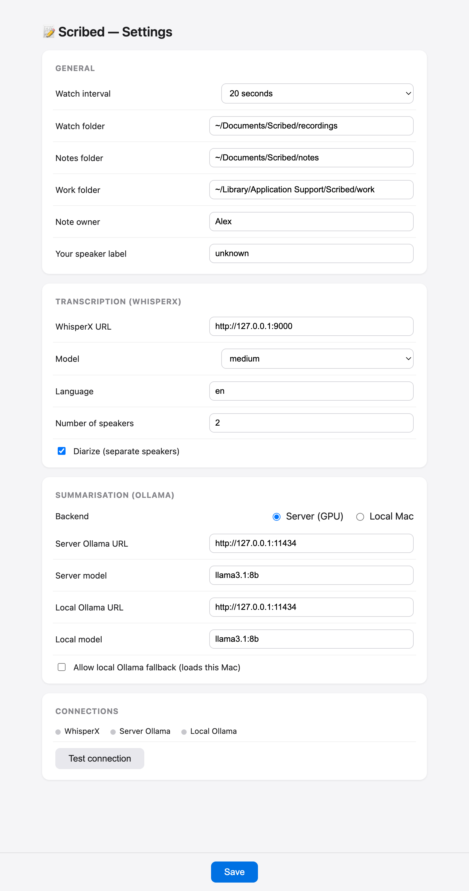

# Distavo


[](LICENSE)


> Drop a recording in a folder, get a tidy Markdown meeting note back.

**Distavo** is a native macOS menu-bar app that watches a folder for audio/video
recordings and automatically turns each new one into a structured Markdown
meeting note. It converts the file locally with **AVFoundation**, transcribes it
on **your own WhisperX server**, summarises the transcript with **your own
Ollama server**, validates the result, and writes a note to your notes folder.

Distavo does not bundle any AI servers — you point it at WhisperX and Ollama
endpoints that you run and trust. **macOS only.**

## Screenshots

The native menu and settings window:

<p align="center">
  
</p>

## Requirements / Prerequisites

- **macOS 13+** (this is a menu-bar app — macOS only).
- **A reachable WhisperX HTTP endpoint** that you run — see
  [WhisperX](https://github.com/m-bain/whisperX).
- **A reachable Ollama HTTP endpoint** with a model pulled (for example
  `llama3.1:8b`) — see [Ollama](https://ollama.com).

These servers can be on `localhost`, on another machine on your network, or
anywhere you can reach — Distavo never starts them for you, and only ever talks
to the URLs you configure.

## Install

Distavo is heading to the **Mac App Store** and **Setapp**; a notarized
direct-download build is published on [GitHub Releases](https://github.com/Joanmarcriera/distavo/releases).

To build from source you need [XcodeGen](https://github.com/yonaskolb/XcodeGen)
(`brew install xcodegen`):

```sh
cd apple
xcodegen generate
xcodebuild -project Distavo.xcodeproj -scheme Distavo -configuration Release \
  -derivedDataPath build CODE_SIGNING_ALLOWED=NO build
# the app is written under apple/build/Build/Products/Release/Distavo.app
```

Distavo launches as a menu-bar agent (no Dock icon) and can start at login from
its own settings.

## Configure

Open **Settings…** from the menu bar and fill in:

- your **WhisperX URL** (and model, language, speaker options),
- your **Ollama URL and model** for summarisation,
- the watch / notes / work folders if you want non-default locations.

Use the **Test connection** button to confirm Distavo can reach WhisperX and
Ollama before you drop in a recording.

## How it works

1. Distavo watches the **recordings folder** (default
   `~/Documents/Distavo/recordings`) on a configurable interval.
2. When a new recording appears, **AVFoundation** converts it locally to WAV.
3. The WAV is uploaded to your configured **WhisperX** server for
   transcription.
4. The cleaned transcript is sent to your configured **Ollama** model for
   summarisation.
5. The summary is validated and written as Markdown to the **notes folder**
   (default `~/Documents/Distavo/notes/<name>.md`).

Config and the work/cache directory live under
`~/Library/Application Support/Distavo/`, and logs are written to
`~/Library/Logs/Distavo/distavo.log`.

Supported input formats include `.wav`, `.m4a`, `.mp3`, `.opus`, `.ogg`,
`.flac`, `.aac`, `.mov`, `.mp4`, and `.m4v` (anything AVFoundation can decode).

## Privacy

Distavo is built to keep your data on machines you control:

- Audio is converted to WAV **locally** with AVFoundation.
- The WAV is uploaded **only** to the WhisperX server you configured, and the
  transcript is sent **only** to the Ollama server you configured. These may be
  remote, so **point Distavo only at servers you trust.**
- Notes and transcripts are written in **cleartext** under your home directory.
- **There is no telemetry and no phone-home.** Nothing is sent anywhere except
  the WhisperX/Ollama endpoints you set.

See [PRIVACY.md](PRIVACY.md) for the full statement.

## Contributing

Contributions are welcome — see [CONTRIBUTING.md](CONTRIBUTING.md) and the
[Code of Conduct](CODE_OF_CONDUCT.md).

## Roadmap

Planned direction (direct download → Setapp → Mac App Store) is described in
[ROADMAP.md](ROADMAP.md).

## License

MIT — see [LICENSE](LICENSE).

## Support

Distavo is free and MIT-licensed. If it saves you time, you can support its development:

[](https://marcriera.lemonsqueezy.com/checkout/buy/f5f7099b-cf47-43a4-98e4-3dcbe64933c8)
[](https://github.com/sponsors/joanmarcriera)
[](https://www.buymeacoffee.com/joanmarcriera)
[](https://ko-fi.com/joanmarcriera)
